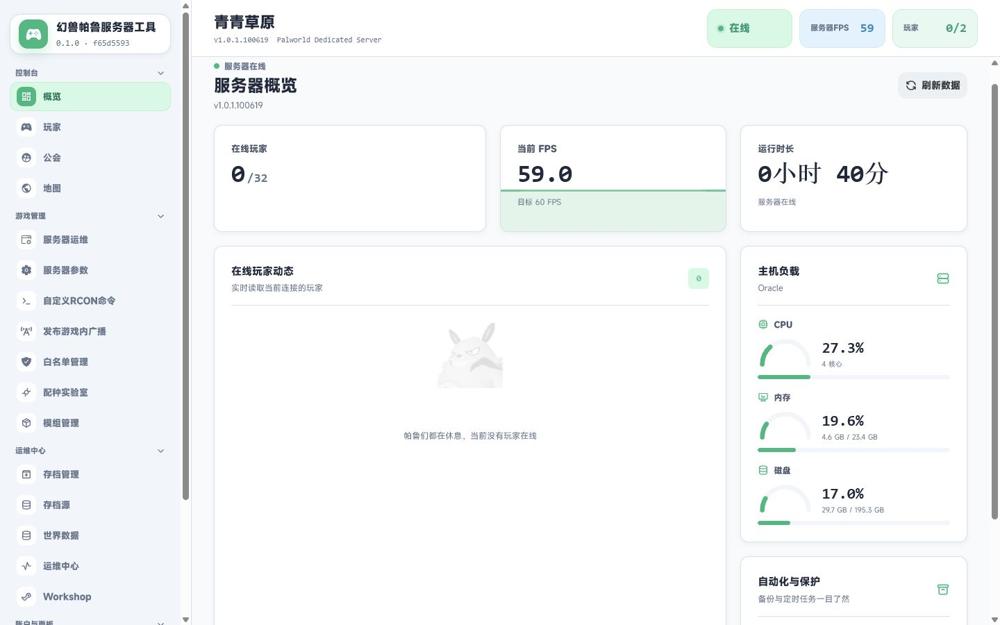
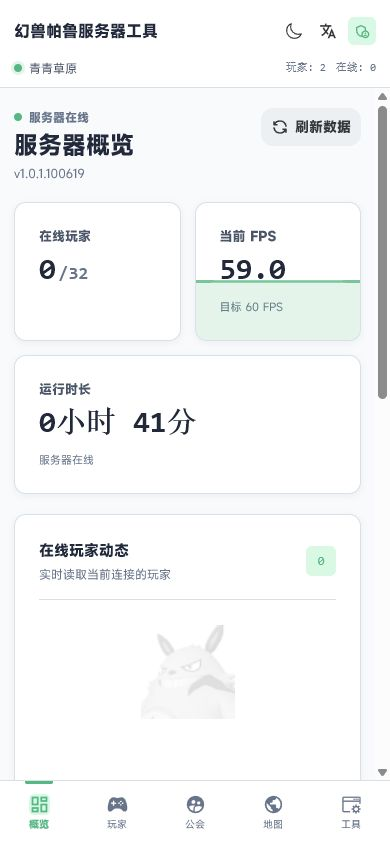

# Palworld Panel

面向《幻兽帕鲁》专用服务器服主的一体化 Web 管理面板。它把服务器部署、实时监控、玩家管理、完整参数配置、存档解析、备份恢复、RCON、模组和自动化集中到同一个界面中。

项目支持 AMD64 与 ARM64，可在面板与游戏同机、Docker 面板配合远程 Agent、Oracle Cloud Ampere A1 等环境中使用。桌面端和移动端均提供简体中文、English、亮色与深色主题。

> 当前功能已经可以正常使用。修改游戏参数不会自动重启 Palworld，是否重启始终由管理员决定。

## 界面预览

### 桌面端



### 移动端

<p align="center">
  
</p>

## 功能概览

| 模块 | 已实现功能 |
| --- | --- |
| 服务器概览 | 在线状态、版本、FPS、在线人数、运行时长、CPU、内存、磁盘、进程状态与备份摘要 |
| 服务器运维 | 部署、启动、停止、重启、更新、手动备份、守护策略、计划重启、内存阈值、重置世界和卸载 |
| 完整配置生成器 | 内置 `pal-conf`，提供 119 个带类型、范围和枚举校验的参数，支持 INI 与 `WorldOption.sav` |
| 玩家管理 | 实时在线状态、UID、Steam64、平台 ID、IP、角色和帕鲁详情、踢出、封禁、解封、白名单 |
| 公会与地图 | 公会成员、会长、基地、在线玩家位置和存档中的世界坐标 |
| 世界数据 | 玩家、帕鲁、物品、容器、基地与其他已解析存档数据 |
| RCON 与广播 | 命令执行、模板、批量导入、玩家/物品/帕鲁占位符、定时任务和广播模板 |
| 存档与备份 | 本机目录、ZIP 导入、Agent 同步、备份创建/校验/下载/恢复/删除及 WebDAV |
| 模组与 Workshop | PAK/配置模组扫描、上传、启用状态以及 Steam Workshop 搜索和安装 |
| 配种实验室 | PalCalc 数据、直接配种、亲本查询、路线计算、存档素材、自定义素材和任务历史 |
| 面板管理 | 多管理员、角色权限、API Key、审计记录、主题、语言和自定义导航 |

## 系统要求与默认端口

- 推荐系统：Ubuntu 或 Debian
- Node.js：18 或更高版本，安装脚本默认安装 Node.js 20
- 架构：AMD64 或 ARM64
- Palworld ARM64：通过 DepotDownloader 与 box64 运行官方 x64 服务端

| 端口 | 协议 | 用途 | 公网建议 |
| --- | --- | --- | --- |
| `19090` | TCP | Web 管理面板 | 限制服主 IP，或置于 HTTPS 反向代理后 |
| `8211` | UDP | 玩家连接游戏 | 需要开放 |
| `25575` | TCP | RCON | 仅本机或可信内网 |
| `8212` | TCP | Palworld REST API | 仅本机或可信内网 |
| `8081` | TCP | 远程 Agent | 仅允许面板主机访问 |

端口都可以在安装或面板配置中调整。

## 快速安装

### Ubuntu / Debian

推荐使用 systemd 安装面板。安装脚本会保留已有的 `data/config.json`，因此也可以用于后续更新。

```bash
sudo apt-get update
sudo apt-get install -y git
git clone https://github.com/Agonie0v0/palworld-panel.git
cd palworld-panel
sudo PANEL_PORT=19090 bash scripts/install-panel.sh
```

安装完成后访问：

```text
http://服务器公网IP:19090
```

脚本会创建并启动 `palworld-panel.service`，默认同时安装存档解析器。

### Oracle Cloud ARM64

Oracle Ampere A1 可以一次安装面板、存档解析器和 Palworld 服务端：

```bash
sudo apt-get update
sudo apt-get install -y git
git clone https://github.com/Agonie0v0/palworld-panel.git
cd palworld-panel
sudo PANEL_PORT=19090 \
  SERVER_NAME="My Palworld Server" \
  bash scripts/install-oci-arm.sh
```

可选环境变量：

| 变量 | 默认值 | 说明 |
| --- | --- | --- |
| `PANEL_PORT` | `19090` | 面板端口 |
| `PANEL_TOKEN` | 自动生成 | 备用登录和 API Token |
| `SERVER_NAME` | `Palworld Oracle ARM` | 游戏服务器名称 |
| `ADMIN_PASSWORD` | 自动生成 | Palworld 管理员密码 |
| `SERVER_PASSWORD` | 空 | 玩家进入服务器的密码 |
| `AUTO_START` | `1` | 安装完成后自动启动游戏服务 |
| `INSTALL_SAVE_PARSER` | `1` | 安装存档解析器 |

更多 ARM64 说明见 [QUICKSTART_ARM.md](QUICKSTART_ARM.md)。

### Docker 面板

Docker 部署适合只容器化面板的场景。如果 Palworld 运行在宿主机 systemd 中，请同时部署远程 Agent，让容器通过 Agent 管理宿主机服务和存档。

```bash
git clone https://github.com/Agonie0v0/palworld-panel.git
cd palworld-panel/deploy
export PANEL_TOKEN="replace-with-a-long-random-token"
docker compose up -d --build
```

配置与备份通过 Docker 卷持久化。

## 首次使用

首次打开面板时，建议按以下顺序配置：

1. 创建面板管理员密码并进入管理模式。
2. 在“服务器运维”中部署新服务器，或接管现有 Palworld 服务。
3. 在“PST 配置”中确认存档路径，并分别测试 REST API 与 RCON。
4. 打开“服务器参数”，载入当前配置，调整参数后保存到服务器。
5. 确认没有玩家在线后，再由管理员手动重启 Palworld 使参数生效。
6. 创建一次手动备份，并确认备份可以下载和校验。

面板涉及四种不同凭据，请勿混用：

| 凭据 | 用途 |
| --- | --- |
| 面板管理员密码 | 登录 WebUI 管理模式 |
| `PANEL_TOKEN` | 备用登录和 API 调用 |
| Palworld `AdminPassword` | 游戏管理、RCON 与 REST API |
| Palworld `ServerPassword` | 玩家加入游戏服务器 |

## 完整服务器配置生成器

“服务器参数”内置了 [Bluefissure/pal-conf](https://github.com/Bluefissure/pal-conf)，不依赖外部配置网站。

- 服务器设置、游戏内设置和高级设置完整分类
- 文本、整数、浮点数、开关、滑块、枚举和多选参数控件
- 一键载入面板当前管理的 `PalWorldSettings.ini`
- 保存前显示变更数量，并保留生成器尚未识别的新参数
- 正确处理枚举、数组、布尔值与带引号字符串
- 导入、生成和复制 `PalWorldSettings.ini`
- 上传、生成和下载 `WorldOption.sav`
- 在 INI 与 SAV 模式之间转换配置

面板顶部的“保存到服务器”始终写入 `PalWorldSettings.ini`，不会自动重启游戏服务。`WorldOption.sav` 由生成器下载后放入对应世界存档目录；若 INI 与 SAV 同时存在，游戏会优先使用 `WorldOption.sav`。

## 数据来源

页面中的数据来自三条独立链路。某一条未配置时，只会影响依赖它的功能。

| 来源 | 提供的数据与操作 |
| --- | --- |
| REST API | 服务器版本、FPS、实时在线玩家、UID、Steam64、平台 ID 和 IP |
| RCON | 在线玩家回退、广播、踢人、封禁、解封、命令和定时任务 |
| 存档解析器 | 历史玩家、公会、基地、地图坐标、帕鲁、物品和容器 |

典型判断方式：

- 概览没有 FPS 或实时状态：检查 REST API。
- 玩家明明在线却显示离线，或 Steam64 为空：检查 REST API 凭据和端口，RCON 仅作为回退。
- 玩家、公会和地图都没有历史数据：检查存档源和解析器。
- 广播、踢人或命令失败：检查 RCON。

## 远程 Agent

面板与游戏服务器不在同一台主机，或 Docker 面板需要管理宿主机服务时，在游戏服务器上安装 Agent：

```bash
sudo apt-get update
sudo apt-get install -y git
git clone https://github.com/Agonie0v0/palworld-panel.git
cd palworld-panel
sudo AGENT_PORT=8081 bash scripts/install-agent.sh
```

安装完成后，在面板“服务器运维 → Agent”中填写 Agent 地址和 Token：

```text
http://游戏服务器IP:8081
```

Agent Token 等同于远程管理权限。请通过安全组或主机防火墙限制 `8081/TCP`，不要直接向全网开放。

## 备份与自动化

面板可以创建、下载、校验、恢复和删除本地备份，并将备份同步到 WebDAV。自动化功能包括：

- 定时备份与保留天数/数量
- 玩家上线、离线广播
- 非白名单玩家自动踢出
- RCON 定时任务
- 定时维护重启与重启前广播
- 服务异常检测与自动恢复
- 内存阈值守护和冷却时间

自动重启、计划重启和内存守护默认关闭。启用前请先确认备份策略；恢复备份、重置世界和卸载属于破坏性操作，面板会要求二次确认。

## 更新

### systemd

在最初克隆的源码目录执行：

```bash
git pull --ff-only
sudo PANEL_DIR=/opt/palworld-panel \
  PANEL_PORT=19090 \
  PANEL_TOKEN="原有的面板Token" \
  bash scripts/install-panel.sh
sudo systemctl status palworld-panel
```

更新时请继续使用原来的 `PANEL_TOKEN`，否则安装脚本会生成新的备用登录 Token。此流程会更新并重启面板服务，不会主动重启 Palworld 游戏服务；现有面板配置保存在 `/opt/palworld-panel/data/`。

### Docker

```bash
cd palworld-panel/deploy
git pull --ff-only
docker compose up -d --build
docker compose logs -f palworld-panel
```

## 常用日志与状态命令

```bash
# 面板
sudo systemctl status palworld-panel
sudo journalctl -u palworld-panel -f

# 游戏服务
sudo systemctl status palworld
sudo journalctl -u palworld -f
```

只有明确需要让新游戏参数生效时，才执行：

```bash
sudo systemctl restart palworld
```

## 常见问题

### 面板能打开，但操作提示未认证

使用首次访问时创建的面板管理员密码。它不是 Palworld `AdminPassword`。管理员密码不可用时，可以使用安装阶段保存的 `PANEL_TOKEN` 进行备用登录。

### 概览、在线玩家或 Steam64 没有数据

在“PST 配置”中检查 REST 地址、端口、用户名和 Palworld `AdminPassword`，然后执行 REST 连接测试。确认游戏配置包含：

```text
RESTAPIEnabled=True
RESTAPIPort=8212
```

修改这些参数后需要重启 Palworld。

### 公会、地图、帕鲁或物品没有数据

确认存档源指向包含 `Level.sav` 的 `Pal/Saved` 目录，并重新安装或检查解析器：

```bash
sudo bash /opt/palworld-panel/scripts/install-sav-parser.sh
sudo systemctl restart palworld-panel
```

这只会重启面板，不会重启游戏服务。

### 广播、踢人或 RCON 命令失败

在“PST 配置”中测试 RCON，确认主机、端口和 `AdminPassword` 正确，并确认游戏配置包含：

```text
RCONEnabled=True
RCONPort=25575
```

### 保存参数后游戏没有变化

面板只负责写入配置，不会自行中断在线玩家。请在合适时间通过“服务器运维”手动重启游戏服务。若世界目录中存在 `WorldOption.sav`，还应注意它的优先级高于 `PalWorldSettings.ini`。

### ARM64 部署失败

确认系统架构为 `aarch64` 或 `arm64`，并查看：

```bash
sudo journalctl -u palworld -n 200 --no-pager
```

## 本地开发

```bash
npm install
pnpm --dir upstream-web install
npm test
npm run check
npm run test:web
npm run build:web
```

前端开发服务器：

```bash
cd upstream-web
pnpm install
pnpm dev
```

`npm run build:web` 会先构建内置 `pal-conf`，同步字段类型和 WASM 资源，再构建主面板。

## 项目结构

```text
src/                    Node.js 面板服务、API 与兼容层
upstream-web/           Vue 管理界面及已构建静态资源
vendor/pal-conf/        内置完整配置生成器源码
parsers/sav_cli/        存档解析器启动与适配
scripts/                面板、游戏服务器、Agent 和解析器安装脚本
deploy/                 Docker 部署配置
systemd/                systemd 服务模板
test/                   Node.js 自动化测试
```

## 致谢与许可证

- [zaigie/palworld-server-tool](https://github.com/zaigie/palworld-server-tool)：功能与兼容体验参考。
- [Bluefissure/pal-conf](https://github.com/Bluefissure/pal-conf)：完整服务器配置生成器，MIT License。
- [deafdudecomputers/PalworldSaveTools](https://github.com/deafdudecomputers/PalworldSaveTools)：存档解析能力。
- PalCalc：配种数据与计算能力。

项目主体采用 MIT License。第三方组件、版权与许可证信息见 [NOTICE.md](NOTICE.md) 和 [THIRD_PARTY_LICENSES](THIRD_PARTY_LICENSES)。
