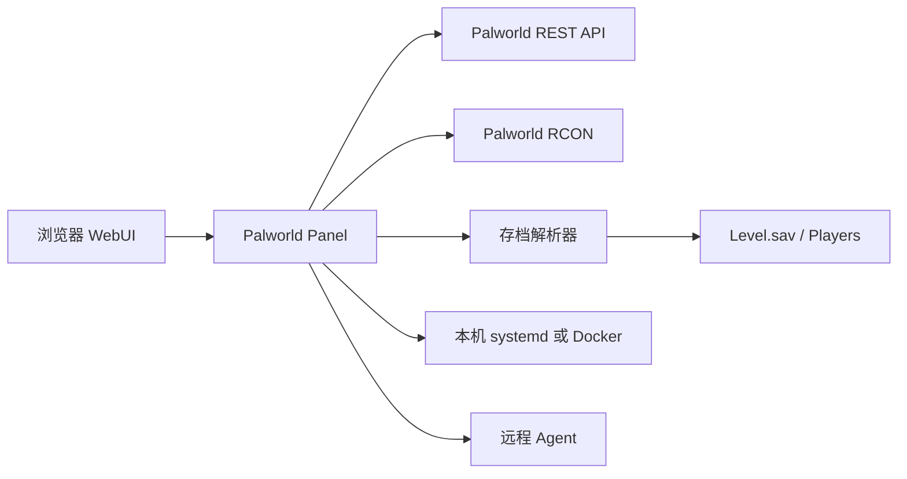

# Palworld Panel

面向《幻兽帕鲁》1.0 专用服务器的 Web 管理面板，支持 AMD64、ARM64，以及单机和远程 Agent 两种部署架构。

项目以 [zaigie/palworld-server-tool](https://github.com/zaigie/palworld-server-tool) 作为主要功能与兼容体验基线，并增加了一键部署、Oracle ARM64 运行、服务器运维、完整参数管理、定时 RCON、远程 Agent 和现代化桌面/移动端界面。

- 默认面板端口：`19090/TCP`
- 默认游戏端口：`8211/UDP`
- 默认 RCON 端口：`25575/TCP`
- 默认 REST API 端口：`8212/TCP`
- 界面语言：简体中文、English
- 界面主题：亮色、深色，选择会自动保存

## 目录

- [项目能力](#项目能力)
- [数据从哪里来](#数据从哪里来)
- [部署](#部署)
- [首次使用](#首次使用)
- [界面与菜单说明](#界面与菜单说明)
- [主视图](#主视图)
- [工具菜单](#工具菜单)
- [配置生成器的正确用法](#配置生成器的正确用法)
- [存档解析器](#存档解析器)
- [自动化任务](#自动化任务)
- [端口与防火墙](#端口与防火墙)
- [文件与数据位置](#文件与数据位置)
- [更新与维护](#更新与维护)
- [常见问题](#常见问题)
- [开发与测试](#开发与测试)
- [致谢与许可证](#致谢与许可证)

## 项目能力

| 分类 | 能力 |
| --- | --- |
| 跨架构部署 | AMD64 使用 SteamCMD，ARM64 使用 DepotDownloader + box64 |
| 一键运维 | 部署、启动、停止、重启、更新、手动备份、重置世界、卸载游戏服务器 |
| 实时监控 | 服务器版本、FPS、帧时间、在线人数、容量、运行时间、游戏天数 |
| 玩家管理 | 搜索、筛选、排序、详情、踢出、封禁、解封、白名单、ID 复制 |
| 存档数据 | 玩家、公会、帕鲁、背包物品、据点与地图坐标解析 |
| 公会管理 | 公会等级、会长、成员、据点、坐标、快速据点图 |
| 世界地图 | 地图瓦片、传送点、高塔、玩家、据点、范围、搜索与聚合标记 |
| RCON | 命令执行、模板管理、文件导入、占位符填充、定时任务 |
| 备份 | 自动备份、手动备份、保留策略、列表、下载、删除 |
| 参数管理 | 常用服务器参数、高级参数、OptionSettings 导入和变更预览 |
| 自动化 | 玩家同步、存档同步、上下线广播、白名单自动踢出、定时 RCON、服务守护、内存阈值和周期重启 |
| 主机监控 | CPU 负载、内存、磁盘、主机运行时间和 Palworld 进程资源 |
| 远程管理 | 面板与游戏服务器分离部署，完整 Agent 模式 |
| 面板能力 | 首次管理员初始化、24 小时登录令牌、备用 Panel Token、TLS |
| 响应式界面 | 桌面侧栏直达全部工具，移动端底部导航和工具抽屉 |

## 数据从哪里来

面板需要同时使用 REST、RCON 和存档解析器。它们不是重复配置，而是负责不同的数据与操作。



| 来源 | 负责内容 | 配置位置 |
| --- | --- | --- |
| REST API | 实时服务器信息、FPS、在线玩家、运行状态 | `PST 配置 -> REST API` |
| RCON | 广播、踢人、封禁、解封、关服、命令和定时任务 | `PST 配置 -> RCON` |
| 存档解析器 | 历史玩家、公会、帕鲁、背包、据点和地图标记 | `PST 配置 -> 存档来源与备份` |
| systemd/Docker | 服务启动、停止、重启和更新 | `服务器运维` |
| Agent | 在另一台机器执行上述服务器操作 | `服务器运维 -> Agent 模式` |

如果实时在线人数正常，但玩家详情、公会或地图没有数据，通常应检查存档解析器，而不是 RCON。

## 部署

项目只有两种部署架构：

| 架构 | 适用场景 |
| --- | --- |
| 单机部署（推荐） | 面板和 Palworld 服务器安装在同一台 AMD64 或 ARM64 Linux 机器 |
| Agent 分离部署 | 面板与游戏服务器位于不同机器，或 Docker 面板需要控制宿主机服务 |

自动安装脚本当前面向 Ubuntu/Debian。其他 Linux 发行版可以手动运行 Node.js 服务，但一键部署脚本需要自行适配包管理器和 systemd。

### 单机部署（推荐）

这是大多数用户应该选择的方式。先安装面板，再打开 WebUI，通过“服务器运维”一键部署 Palworld 服务器。

```bash
sudo apt-get update
sudo apt-get install -y git
git clone https://github.com/Agonie0v0/palworld-panel.git
cd palworld-panel
sudo PANEL_PORT=19090 bash scripts/install-panel.sh
```

可选安装变量：

| 变量 | 默认值 | 说明 |
| --- | --- | --- |
| `PANEL_DIR` | `/opt/palworld-panel` | 面板安装目录 |
| `PANEL_PORT` | `19090` | WebUI 监听端口 |
| `PANEL_TOKEN` | 自动生成 | 备用管理登录 Token |
| `INSTALL_SAVE_PARSER` | `1` | 是否安装存档解析器 |

脚本会创建并启动 `palworld-panel.service`。安装完成后访问：

```text
http://服务器公网IP:19090
```

打开面板后进入“服务器运维”，填写安装目录、服务名称、服务器名称、管理员密码和端口，然后点击“部署服务器”。

部署逻辑：

| 架构 | 下载与运行方式 |
| --- | --- |
| `x86_64` / AMD64 | SteamCMD + 官方 Linux 服务端 |
| `aarch64` / ARM64 | DepotDownloader ARM64 + box64 运行 x64 服务端 |

Oracle Cloud Ampere A1 用户如果希望一次安装面板和游戏服务器，可以改用：

```bash
sudo PANEL_PORT=19090 \
  SERVER_NAME="My Palworld Server" \
  bash scripts/install-oci-arm.sh
```

该脚本会额外安装 DepotDownloader、box64 和 Palworld systemd 服务，并输出面板地址、管理 Token、游戏管理员密码和玩家连接端口。

需要将面板本身运行在 Docker 中时，使用：

```bash
git clone https://github.com/Agonie0v0/palworld-panel.git
cd palworld-panel/deploy
export PANEL_TOKEN="替换为足够长的随机字符串"
docker compose up -d --build
```

访问：

```text
http://服务器公网IP:19090
```

Docker 镜像包含：

- Node.js 面板后端
- 完整 WebUI
- 地图瓦片与静态资源
- Python 存档解析环境
- Docker CLI 和 Compose

默认持久化卷：

| 数据 | Docker 位置 |
| --- | --- |
| 面板配置 | `panel-data:/data` |
| 备份 | `palworld-backups:/backups` |
| 游戏目录 | `deploy/palworld:/palworld` |

Docker 容器不能直接控制宿主机 systemd。如果 Palworld 运行在宿主机上，请使用下面的 Agent 分离部署；挂载 Docker Socket 不等于获得宿主机 systemd 权限。

### Agent 分离部署

Agent 用于让面板管理另一台机器，或让 Docker 面板管理宿主机上的游戏服务。

在游戏服务器机器执行：

```bash
sudo apt-get update
sudo apt-get install -y git
git clone https://github.com/Agonie0v0/palworld-panel.git
cd palworld-panel
sudo AGENT_PORT=8081 bash scripts/install-agent.sh
```

安装脚本会输出 Agent 地址和 Agent Token，并创建：

```text
palworld-agent.service
```

然后在面板中打开：

```text
工具 -> 服务器运维 -> Agent 模式
```

填写：

| 字段 | 内容 |
| --- | --- |
| 启用 Agent | 开启 |
| 连接模式 | 远程 |
| Agent 地址 | `http://游戏服务器IP:8081` |
| Agent 密钥 | 安装脚本输出的 Token |

保存后点击“测试连接”。连接成功后，服务器部署、启停、更新、备份、RCON、REST、存档解析和配置保存会在 Agent 机器执行。

Docker 面板连接同机 Agent 时，可以使用：

```text
http://host.docker.internal:8081
```

只允许面板机器访问 Agent 端口，不要将 Agent Token 和端口公开给所有公网来源。

### 仅兼容 pst-agent 存档同步

如果已经部署 [zaigie/palworld-server-tool](https://github.com/zaigie/palworld-server-tool) 的 `pst-agent`，可以只复用它的存档同步接口。

在 `PST 配置 -> 存档来源与备份` 中选择 `pst-agent`，填写：

```text
http://游戏服务器IP:8081/sync
```

面板会下载 `sav.zip` 并解析。`pst-agent` 只是兼容的存档来源，不是一种完整部署方式：它不负责远程启停、更新、RCON 或 REST。需要完整远程管理时，请使用本项目 Agent。

## 首次使用

1. 打开 `http://服务器IP:19090`。
2. 创建面板管理员密码。
3. 进入管理模式。
4. 打开“PST 配置”，测试存档、RCON 和 REST 连接。
5. 尚未安装游戏服务器时，打开“服务器运维”执行一键部署。
6. 打开“服务器参数”设置服务器名称、密码、端口和倍率。
7. 保存参数后重启 Palworld 游戏服务器。

面板管理员密码、Panel Token、Palworld `AdminPassword` 和进服密码是四个不同用途的凭据：

| 凭据 | 用途 |
| --- | --- |
| 面板管理员密码 | 登录 WebUI 管理模式 |
| Panel Token | 忘记管理员密码时的备用登录方式，也可用于 API |
| Palworld `AdminPassword` | 游戏内管理员和 RCON/REST 配置相关凭据 |
| `ServerPassword` | 普通玩家进入服务器时使用 |

登录令牌有效期为 24 小时。修改面板管理员密码后，旧登录令牌会失效。

## 界面与菜单说明

### 桌面端

左侧固定显示四个主视图；服务器运维、配置、备份、RCON、高级功能等 18 个工具集中在顶部工具架，不需要展开“控制中心”或二级菜单。高分辨率屏幕会自动扩大工作区和工具按钮。

### 移动端

底部导航提供：

```text
概览 | 玩家 | 公会 | 地图 | 工具
```

点击“工具”后可以打开全部 18 个管理工具。工具面板会先关闭，再打开对应功能弹窗，避免出现多层弹窗。

### 主题与语言

- 点击太阳/月亮按钮切换亮色和深色主题。
- 主题会保存在浏览器中，刷新后继续使用。
- 语言只提供简体中文和 English。

## 主视图

### 概览

概览用于快速判断服务器是否正常，以及下一步需要处理什么。

显示内容：

- 服务器名称和版本
- 在线/离线状态
- 服务器运行时间和游戏天数
- FPS 和 60 FPS 目标比例
- 当前在线人数、最大人数和容量占用率
- 主机 CPU 负载、内存和磁盘使用率
- Palworld 进程 CPU、内存与主机运行时间
- 当前备份数量与最近备份时间
- 当前在线玩家摘要
- 已启用的 RCON 定时任务
- 下一个任务和下次执行时间

点击右上角“刷新”会重新读取服务器、主机负载、在线玩家、备份和任务状态。主机负载在首页停留期间每 30 秒自动更新一次。

### 玩家

玩家页左侧为玩家列表，右侧为当前玩家详情。

列表功能：

- 搜索昵称、玩家 UID、Steam64 和平台用户 ID
- 按在线/离线筛选
- 按 Steam、Xbox、PS5、Mac 等平台筛选
- 按白名单/非白名单筛选
- 按最近在线、等级或昵称排序
- 显示平台、等级、白名单和最后在线时间

玩家详情：

- 昵称、等级、在线状态和公会
- 玩家 UID、Steam64、平台 ID
- 一键复制玩家 UID 和 Steam64
- 状态点与角色属性
- 玩家拥有的帕鲁列表
- 按帕鲁类型或被动技能搜索
- 背包、重要物品、武器栏和防具栏
- 物品名称、说明与数量

管理操作：

- 加入或移出白名单
- 踢出在线玩家
- 封禁玩家
- 解除封禁
- 从玩家详情跳转到所属公会

踢出、封禁和解封依赖 RCON；历史详情、帕鲁和物品依赖存档解析器。

### 公会

公会页提供公会列表和公会详情。

列表功能：

- 搜索公会名称、会长和成员
- 筛选有名称/无名称公会
- 按公会等级、成员数、据点数或名称排序
- 显示公会等级、会长、成员数和据点数

公会详情：

- 公会名称和等级
- 会长信息
- 成员名册
- 成员白名单状态
- 从成员直接跳转到玩家详情
- 据点数量、据点 ID、X/Y 坐标和范围
- 据点快速分布图
- 点击快速图标记定位对应据点卡片

公会和据点数据来自存档解析器。

### 帕鲁详情

在玩家详情中点击帕鲁可查看：

- 帕鲁类型和等级
- 稀有、塔主等特殊标记
- 攻击、防御和血量潜力
- 星级
- 攻击、防御、作业速度强化
- 被动词条名称与说明
- 帕鲁内部 ID，可用于 RCON 模板

### 地图

地图使用项目内置世界地图瓦片，并叠加静态地标和存档标记。

支持显示：

- 传送点
- 高塔
- 在线玩家
- 全部有最后坐标的玩家
- 公会据点
- 据点作用范围

地图操作：

- 单独开关每类标记
- 在“仅在线”和“全部玩家”之间切换
- 搜索玩家或公会据点并自动定位
- 放大和缩小
- 自动聚合距离较近的据点标记
- 点击玩家查看昵称、等级、坐标和公会
- 点击据点查看公会成员、等级和坐标
- 从地图跳转到玩家或公会详情

玩家和据点标记依赖存档解析器；传送点和高塔属于内置静态地图数据。

## 工具菜单

### 服务器运维

服务器运维是游戏服务器生命周期管理入口，使用居中弹窗，包含四个页签。

#### 服务与部署

- 查看运行状态
- 查看服务管理器、系统架构和运行方式
- 启动服务器
- 停止服务器
- 重启服务器
- 更新 Palworld 服务端
- 立即创建手动备份
- 一键部署游戏服务器

一键部署字段：

- 安装目录
- systemd 服务名称
- 服务器名称与描述
- `AdminPassword`
- 玩家进服密码
- 游戏 UDP 端口
- RCON 端口
- REST API 端口
- 部署完成后是否立即启动

#### 监控与守护

监控区域同时显示受管主机和 Palworld 游戏进程的状态：

- 主机 CPU 一分钟平均负载，并按 CPU 核心数换算为百分比
- 主机内存使用量与使用率
- 游戏安装目录所在磁盘的容量和使用率
- Palworld 主进程 PID、CPU、内存和运行时间
- 主机名称与主机运行时间

使用远程 Agent 时，数据来自游戏服务器机器，而不是面板机器。Windows 环境无法读取 Linux `df` 和 `ps` 指标时，会将对应项目显示为不可用。

自动守护默认关闭，启用后可以设置：

- 检测间隔
- 服务连续停止多少次后自动启动
- 主机内存使用率达到阈值后自动重启
- 内存需要连续超限多少次才触发，避免瞬时波动误判
- 自动重启后的冷却时间，避免高内存状态造成重启循环
- 每隔多少小时执行一次计划重启
- 重启前的维护广播和倒计时
- 是否在自动重启前创建存档备份

内存阈值和周期重启设置为 `0` 时禁用。广播内容中的 `{seconds}` 会替换为实际倒计时秒数。自动重启期间会显示当前状态和最近一次守护动作；如果备份、广播或重启失败，面板会保留最近错误。

#### Agent 模式

- 启用或关闭 Agent
- 选择本机或远程连接
- 设置 Agent 地址和 Token
- 保存 Agent 配置
- 测试 Agent 连接

#### 维护

- 重置世界：先备份，再删除当前世界并启动新世界
- 卸载服务器：先备份，再删除受管游戏服务器，保留面板和备份

维护操作不可逆，执行前请确认备份可以正常下载。

### PST 配置

PST 配置控制面板如何连接 Palworld、如何同步数据，以及面板自身的 Web 设置。

#### 存档来源与备份

- 选择本机目录或 `pst-agent`
- 浏览服务器目录
- 设置包含 `Level.sav` 的 Saved 目录
- 自定义 `sav_cli` 路径
- 测试存档来源
- 设置存档同步间隔
- 设置自动备份间隔
- 设置备份保留天数

#### RCON

- RCON 地址
- RCON 密码
- 请求超时
- Base64 模式
- 连接测试

#### REST API

- REST 地址与协议
- 用户名和密码
- 请求超时

#### 玩家任务与管理

- 玩家同步间隔
- 玩家上线/下线广播
- 自定义上线消息
- 自定义下线消息
- 自动踢出不在白名单中的玩家

#### Web 服务

- 面板监听端口
- Web TLS 开关
- TLS 证书路径
- TLS 私钥路径
- 公网访问地址

#### 管理员安全

- 修改面板管理员密码
- 查看面板密码与游戏管理员密码的用途说明

大部分配置保存后立即生效。Web 端口、TLS 和部分任务周期需要重启 `palworld-panel.service`。

### 服务器参数

服务器参数直接管理 `PalWorldSettings.ini`。

内置分类：

- 基础信息与密码
- 网络与管理接口
- 世界规则
- 倍率设置
- 高级参数

常用字段包括服务器名称、描述、管理员密码、进服密码、游戏端口、RCON、REST API、难度、死亡惩罚、昼夜速度、经验倍率和捕获倍率。

高级参数允许添加界面未预置的任意 `OptionSettings` 键值。未知参数会保留，不会因为编辑常用字段而被删除。

#### 导入配置

可以粘贴：

- 完整 `PalWorldSettings.ini`
- `OptionSettings=(...)`
- 逗号分隔的参数列表

导入流程会显示新增、变更和未变化参数。点击“应用到表单”只修改当前表单，必须再点击“保存”才会写入服务器。

保存后需要重启 Palworld 游戏服务器才能让大多数游戏参数生效。

### 配置生成器

该入口会打开外部生成器 [pal-conf.bluefissure.com](https://pal-conf.bluefissure.com/)。它只负责生成配置文本，不会自动修改当前服务器。

完整使用方法见 [配置生成器的正确用法](#配置生成器的正确用法)。

### RCON 命令

RCON 工具包含“已有命令”和“定时任务”两个页签。

#### 占位符素材

可以先选择玩家、物品和帕鲁，然后自动填充模板。

支持：

| 占位符 | 内容 |
| --- | --- |
| `{playerid}` | 玩家 UID |
| `{steamid}` | RCON 使用的 Steam ID |
| `{userid}` | 平台用户 ID |
| `{itemid}` | 物品 ID |
| `{palid}` | 帕鲁 ID |
| `{steamUserID}` | 兼容旧模板的 Steam ID 写法 |

#### 命令模板

- 新增命令
- 编辑命令名称、命令和参数模板
- 删除未被定时任务引用的命令
- 填充占位符
- 输入附加参数并立即执行
- 从命令直接创建定时任务
- 从文件批量导入

导入文件每行格式：

```text
command,remark,placeholder
```

#### 定时任务

- 绑定已有 RCON 命令
- 固定当前参数内容
- 每隔 N 分钟执行
- 每天指定时间执行
- 每周指定星期和时间执行
- 使用五段 Cron 表达式
- 启用或暂停任务
- 编辑和删除任务
- 立即手动执行
- 查看下次执行、最近执行、执行次数、结果和错误

任务保存在面板数据目录中，面板重启后仍会恢复。

### 存档管理

存档管理显示已有备份文件。

- 查看备份时间和路径
- 下载备份到本地
- 删除备份
- 显示空备份提示

创建备份的位置：

| 方式 | 入口 |
| --- | --- |
| 手动备份 | `服务器运维 -> 服务与部署 -> 存档管理` |
| 自动备份 | `PST 配置 -> 存档来源与备份` |
| 重置/卸载前备份 | `服务器运维 -> 维护` 自动执行 |

备份清理会先按保留天数处理，再应用最大备份数量限制。

### 白名单管理

- 从已经解析的玩家中选择并添加
- 手动填写昵称、玩家 UID 和 Steam64
- 修改现有白名单记录
- 删除白名单记录
- 保存后同步刷新玩家列表标记

开启 `PST 配置 -> 自动踢出不在白名单中的玩家` 后，面板会在玩家同步时检查 UID 和 Steam64，并通过 RCON 踢出未匹配玩家。

### 游戏内广播

- 输入最多 500 字的广播内容
- 使用重启、维护和欢迎模板
- 实时预览玩家端文本
- 通过 RCON 向全部在线玩家发送

广播要求 RCON 地址和密码正确。

### 关闭服务器

这是危险操作，面板会要求：

- 设置 10 到 3600 秒倒计时
- 编辑关服广播内容
- 输入 `SHUTDOWN` 二次确认

提交后通过 RCON 发送倒计时关服命令。它与“服务器运维”中的立即停止不同，适合有玩家在线时提前通知并平滑关服。

## 配置生成器的正确用法

1. 点击左侧“配置生成器”。
2. 在外部页面调整所需参数。
3. 生成完整 `PalWorldSettings.ini` 或 `OptionSettings=(...)`。
4. 回到面板，打开“服务器参数”。
5. 点击“导入配置”。
6. 粘贴生成内容并检查变更预览。
7. 点击“应用到表单”。
8. 检查密码、端口和高级参数。
9. 点击“保存”。
10. 在“服务器运维”中重启游戏服务器。

导入采用合并模式。生成内容中未出现的当前参数会继续保留；敏感字段在预览中会掩码显示。

## 存档解析器

项目通过 `parsers/sav_cli/run-save-parser` 调用 Python 解析器。安装脚本会创建独立虚拟环境并安装固定版本的 PalworldSaveTools 依赖。

默认命令：

```text
/opt/palworld-panel/parsers/sav_cli/run-save-parser
```

输入目录应包含可以找到 `Level.sav` 的 `SaveGames` 结构，例如：

```text
/opt/palworld/server/Pal/Saved/SaveGames
```

验证解析器：

```bash
sudo /opt/palworld-panel/parsers/sav_cli/run-save-parser \
  /opt/palworld/server/Pal/Saved/SaveGames >/tmp/palworld-save.json
```

成功时会生成包含 `players`、`guilds`、`pals`、`inventory` 和 `map` 的 JSON。

解析器权限异常时：

```bash
sudo chmod +x /opt/palworld-panel/parsers/sav_cli/run-save-parser
sudo systemctl restart palworld-panel
```

解析器依赖升级时建议重新执行：

```bash
cd palworld-panel
sudo bash scripts/install-sav-parser.sh
```

## 自动化任务

面板后台调度器每秒检查任务是否到期，但只有达到各自配置周期时才执行。

| 自动化 | 配置位置 | 设置为 `0` |
| --- | --- | --- |
| 在线玩家同步 | PST 配置 | 禁用 |
| 存档解析同步 | PST 配置 | 禁用 |
| 自动备份 | PST 配置 | 禁用 |
| 周期广播 | 配置文件 | 禁用 |
| RCON 定时任务检查 | 配置文件 | 最低按 1 秒处理 |
| 服务停止自动恢复 | 服务器运维 -> 监控与守护 | 关闭守护或关闭自动恢复 |
| 主机内存阈值重启 | 服务器运维 -> 监控与守护 | 阈值设为 `0` |
| 周期维护重启 | 服务器运维 -> 监控与守护 | 间隔设为 `0` |

RCON 定时任务使用独立任务列表，可以在 WebUI 中启用、暂停、立即执行和查看错误。

自动守护只在面板进程运行时调度。单机模式由面板直接管理服务；Agent 模式由面板读取远程主机指标，并让 Agent 执行备份、启动或重启。

## 端口与防火墙

需要同时在云平台安全列表/NSG 和系统防火墙中放行端口。

| 端口 | 协议 | 用途 | 建议 |
| --- | --- | --- | --- |
| 19090 | TCP | Web 面板 | 只允许可信管理来源更安全 |
| 8211 | UDP | 玩家连接 | 必须允许玩家来源访问 |
| 8212 | TCP | Palworld REST API | 不建议直接公开到公网 |
| 25575 | TCP | RCON | 不建议直接公开到公网 |
| 8081 | TCP | Agent | 只允许面板机器访问 |

Ubuntu/Debian 可以执行：

```bash
sudo bash scripts/firewall-ubuntu.sh
```

该脚本只处理系统防火墙，Oracle Cloud、AWS、Azure 等云平台的安全规则仍需在控制台配置。

## 文件与数据位置

单机安装默认位置：

| 内容 | 路径 |
| --- | --- |
| 面板程序 | `/opt/palworld-panel` |
| 面板配置 | `/opt/palworld-panel/data/config.json` |
| 面板运行数据 | `/opt/palworld-panel/data` |
| 存档解析器环境 | `/opt/palworld-panel/parsers/sav_cli/.venv` |
| 游戏服务器 | `/opt/palworld/server` |
| Palworld Saved | `/opt/palworld/server/Pal/Saved` |
| 备份目录 | `/opt/palworld/backups` |
| Agent | `/opt/palworld-agent` |

重要数据：

- 更新或重新安装时保留 `data`。
- 不要删除 Palworld `Saved` 目录。
- 定期将备份下载到另一台机器或对象存储。
- 重新安装解析器时可以重建 `.venv`，但不要误删游戏存档。

## 更新与维护

### 更新宿主机面板

```bash
cd palworld-panel
git pull
sudo bash scripts/install-panel.sh
```

脚本会保留已有 `/opt/palworld-panel/data/config.json`。

### 更新 Docker 面板

```bash
cd palworld-panel
git pull
cd deploy
docker compose up -d --build
```

### 更新 Agent

```bash
cd palworld-panel
git pull
sudo bash scripts/install-agent.sh
```

### 常用服务命令

```bash
sudo systemctl status palworld-panel
sudo systemctl restart palworld-panel
sudo systemctl status palworld
sudo systemctl restart palworld
journalctl -u palworld-panel -f
journalctl -u palworld -f
```

## 常见问题

### 页面可以打开，但所有管理操作都提示未认证

先创建管理员或进入管理模式。可以使用管理员密码，也可以使用安装脚本输出的 Panel Token。

### 在线人数正常，但玩家详情、公会、帕鲁和地图没有数据

检查：

1. `PST 配置 -> 存档来源与备份` 的目录是否正确。
2. 目录下是否能找到 `Level.sav`。
3. `run-save-parser` 是否有执行权限。
4. `journalctl -u palworld-panel -f` 是否出现解析错误。
5. 点击 PST 配置中的存档“测试”。

### 广播、踢人、关服或 RCON 命令失败

检查：

1. `RCONEnabled=True`。
2. RCON 端口与 `PalWorldSettings.ini` 一致。
3. RCON 密码正确。
4. 面板到 RCON 地址的网络可达。
5. Base64 模式是否与服务端需要的模式一致。

### 实时服务器信息为空

检查 REST API 是否启用、端口、用户名、密码和协议是否正确。默认 REST 用户名为 `admin`。

### 保存服务器参数后游戏没有变化

“服务器参数”保存的是 `PalWorldSettings.ini`。保存后请在“服务器运维”中重启 Palworld 游戏服务器。

### Docker 面板不能启动或停止宿主机服务

Docker 容器不能直接管理宿主机 systemd。请在宿主机安装 Agent，并在“服务器运维 -> Agent 模式”中连接。

### ARM64 一键部署失败

检查：

- 系统架构是否为 `aarch64`/`arm64`
- Ubuntu/Debian 软件源是否可用
- GitHub 是否能下载 DepotDownloader
- box64 软件源是否可访问
- 磁盘空间和内存是否充足
- `journalctl -u palworld -f` 中的启动错误

### 面板端口被占用

安装时指定其他端口：

```bash
sudo PANEL_PORT=19190 bash scripts/install-panel.sh
```

也可以修改配置后重启面板，但环境变量 `PORT` 或 systemd 服务中的端口覆盖会优先生效。

### 忘记管理员密码

优先使用安装时保存的 Panel Token 登录，然后在 `PST 配置 -> 管理员安全` 中设置新密码。

## 高级功能

### 运维中心

“运维中心”集中显示服务器日志、主机历史负载、后台任务、失败告警、计划任务和操作审计。备份校验、恢复和 Workshop 安装等耗时操作会进入后台任务队列，不会阻塞浏览器页面。

### 备份与 WebDAV

“备份与恢复”支持：

- 创建、下载和删除备份
- SHA-256 与压缩包结构校验
- 恢复前自动创建保护备份
- 恢复失败时自动回滚原世界
- WebDAV 连接测试、远程目录创建和单个备份上传

安全恢复必须输入完整备份文件名确认。公网 WebDAV 地址必须使用 HTTPS，局域网和回环地址可以使用 HTTP。

### 存档源与世界数据

“存档源”可以管理当前服务器世界、服务器本地目录和 ZIP 导入世界。每个存档源都可以切换为当前解析源并重建索引。

“世界数据”提供独立的基地、全局仓储容器和全部帕鲁视图。1.0 存档解析器会输出玩家六类背包、所有 `ItemContainerSaveData` 容器、基地、公会和帕鲁数据。

### 本地模组与 Workshop

“模组管理”支持 Pak、LogicMods、UE4SS 文件扫描、ZIP/PAK/UTOC/UCAS/DLL 上传、启用、停用和删除。

“Steam Workshop”支持：

- Steam Web API 搜索和真实预览图
- 公开 Workshop 详情读取
- SteamCMD 后台安装和更新
- 已安装模组启用、停用和删除
- OpenAI 兼容接口翻译标题与说明

Workshop 搜索需要管理员在设置中填写 Steam Web API Key。翻译接口公网地址必须使用 HTTPS，API Key 只保存在面板服务器。

### 配种实验室

配种实验室使用固定版本 [PalCalc v1.17.6](https://github.com/tylercamp/palcalc/tree/v1.17.6) 的 MIT 数据，包含 299 种帕鲁和 44,851 组配种结果。支持：

- 双亲查询子代
- 按目标帕鲁反查全部亲本组合
- 从当前启用存档和自定义素材库中已拥有的帕鲁求多代路线
- 设置目标性别、必须/可选被动、最低 IV、最大代数、迭代数和线程数
- 后台配种任务排队、暂停、继续、取消和进度查看
- 结果历史、存档变化过期标记、成功率/蛋数/耗时估算
- 完整配种预设和自定义帕鲁素材库管理

PalCalc 数据被压缩为平台无关的只读目录，因此 AMD64 和 ARM64 面板都能直接使用，不需要额外运行 .NET 服务。

### 多管理员与 API Key

“账号权限”支持管理员、运维员、只读账号和可撤销 API Key。修改账号密码或角色后，旧登录令牌立即失效。

| 角色 | 主要权限 |
| --- | --- |
| 管理员 | 所有功能，包括账号、密钥和敏感第三方配置 |
| 运维员 | 服务、玩家、备份、模组、计划任务等日常运维 |
| 只读 | 查看服务器和存档数据 |

API Key 只在创建时显示一次，面板只保存 SHA-256 摘要。

## 安全建议

- 部署后立即修改默认 Palworld `AdminPassword`。
- Panel Token 与游戏管理员密码使用不同的随机字符串。
- 不要将 RCON、REST 和 Agent 端口开放给所有公网 IP。
- 面板公网开放时建议配置 HTTPS 或放在可信反向代理后。
- Agent 只允许面板服务器访问。
- 定期下载备份到另一台机器。
- 执行重置世界和卸载前确认备份文件可以正常下载。
- 不要将包含密码的 `data/config.json` 提交到 Git。

## 开发与测试

后端依赖：

```bash
npm ci
```

前端依赖：

```bash
pnpm --dir upstream-web install
```

检查和测试：

```bash
npm run check
npm test
npm run test:web
npm run build:web
docker compose -f deploy/docker-compose.yml config
```

本地启动：

```bash
PANEL_TOKEN=development-token PORT=19090 npm start
```

Windows PowerShell：

```powershell
$env:PANEL_TOKEN = "development-token"
$env:PORT = "19090"
npm start
```

## 致谢与许可证

本项目的管理界面、玩家与公会信息结构、RCON/备份工作流、地图方案、地图瓦片和部分存档解析流程，以 [zaigie/palworld-server-tool](https://github.com/zaigie/palworld-server-tool) 为主要兼容与实现基线。

感谢 zaigie 及该项目贡献者长期维护并公开这些成果。

主机监控、内存阈值和维护重启的产品思路参考了 [Hoshinonyaruko/palworld-go](https://github.com/Hoshinonyaruko/palworld-go)。本项目针对 Linux、AMD64、ARM64 和远程 Agent 架构独立实现，没有复制其 Go 或 Vue 源码。`palworld-go` 中依赖 Windows DLL、UE4SS、PalGuard 和 RAMMap 的功能不适用于当前 Oracle ARM64 部署，因此没有直接移植。

多存档、PalCalc 配种任务、WebDAV 与 Workshop 工作流的产品体验参考了 [uitok/palworld-panel](https://github.com/uitok/palworld-panel)。该项目使用 GPL-3.0-or-later；本项目仅根据公开功能说明和 API 行为进行独立实现，没有复制其 Go、React 或其他 GPL 源码。

`palworld-server-tool` 使用 Apache License 2.0，版权声明为 `Copyright 2024 zaigie`。对应许可证保存在：

[THIRD_PARTY_LICENSES/palworld-server-tool-LICENSE](THIRD_PARTY_LICENSES/palworld-server-tool-LICENSE)

其他依赖和存档解析器的许可证说明见 [NOTICE.md](NOTICE.md) 及各组件目录中的许可证文件。

本项目原创代码使用 MIT License；复制或派生自第三方项目的内容继续遵守其原许可证。
