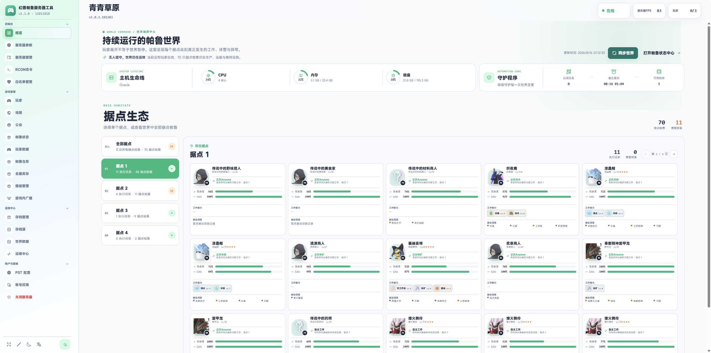
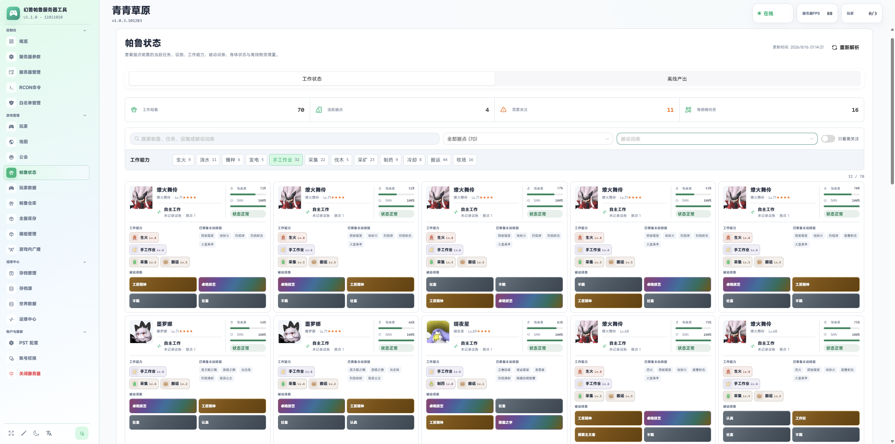
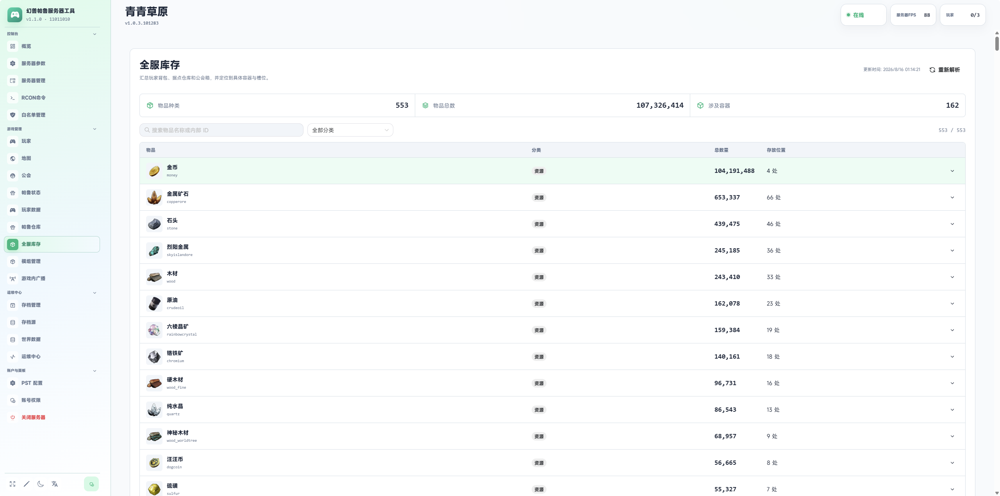
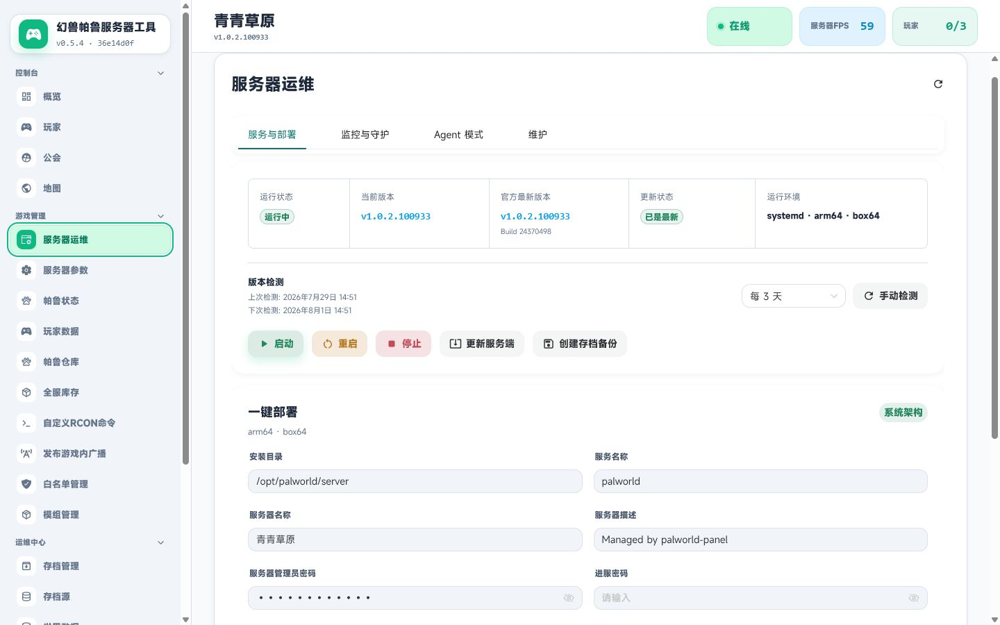
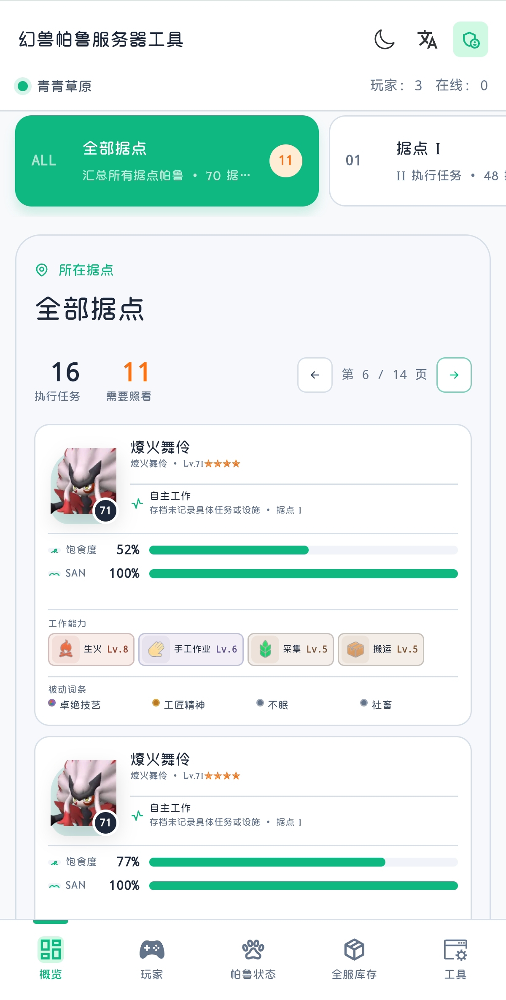
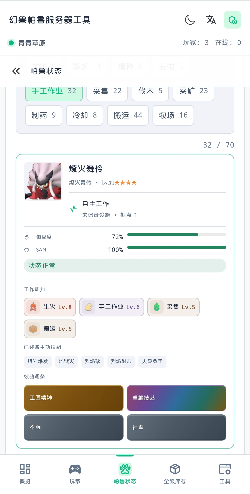
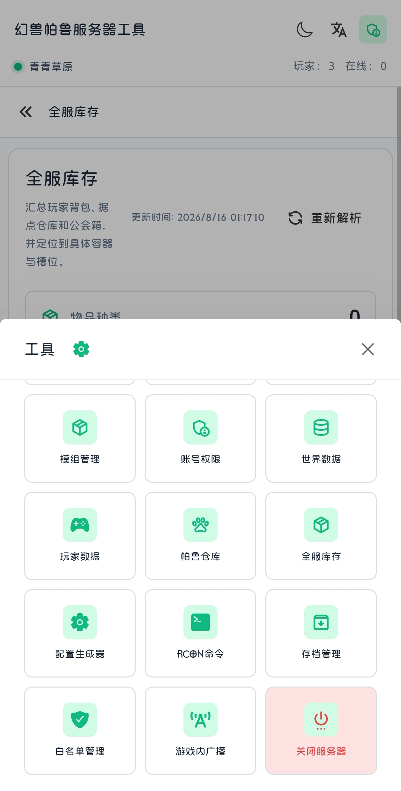

# Palworld Panel

[](https://github.com/Agonie0v0/palworld-panel/releases)
[](#许可证)
[](https://nodejs.org/)

面向 Palworld 专用服务器的开源 Web 管理面板。它把部署、运行状态、玩家、据点帕鲁、世界数据、服务器参数、备份、RCON 和自动化任务集中到一个界面中，桌面端与移动端均可使用。

当前版本：**1.1.0**

## 界面预览

以下截图来自当前版本 `v1.1.0`，覆盖桌面端和移动端的主要工作区。

### 桌面端

<div align="center">
  
  
  <br />
  
  
</div>

### 移动端

<div align="center">
  
  
  
</div>

## 核心功能

- **服务器总览**：在线状态、版本、FPS、在线玩家、运行时长、CPU、内存、磁盘和备份摘要。
- **服务器运维**：部署、启动、停止、重启、更新、实时日志、版本检查和服务守护。
- **帕鲁与据点**：查看据点内帕鲁的工作状态、饱食度、SAN、工作能力、主动技能和完整被动词条；支持缓存、定时刷新和手动同步。
- **玩家与公会**：在线玩家、历史玩家、公会成员、位置、角色、踢出、封禁、解封和白名单。
- **世界数据**：图鉴、捕获记录、传送点、探索区域、头目、地下城、科技点、配方、油田和存档坐标。
- **帕鲁仓库与全服库存**：按类别、数量、归属、容器、槽位和坐标检索物品与帕鲁。
- **服务器参数**：内置带类型、范围和枚举校验的配置生成器，支持 `PalWorldSettings.ini` 与 `WorldOption.sav`。
- **RCON 与广播**：命令执行、模板、批量导入、玩家/物品/帕鲁占位符、定时任务和广播模板。
- **备份与同步**：本地备份的创建、校验、下载、恢复、删除，以及 WebDAV 和远程 Agent 同步。
- **模块与创意工坊**：扫描、上传、启用和管理 PAK/配置模块，并支持 Steam 创意工坊检索。
- **多语言与响应式界面**：简体中文、English、日文，亮色/深色主题，以及适配手机屏幕的底部导航。

## 系统要求

- Ubuntu 或 Debian（安装脚本已自动化）
- Node.js 18 或更高版本；安装脚本默认使用 Node.js 20
- Palworld 专用服务器（可由面板所在主机、容器或远程 Agent 管理）
- 使用 Docker 部署面板时，需要 Docker Engine 和 Compose V2

安装脚本会自动安装运行面板所需的 Node.js、依赖和存档解析器。游戏服务端本身的安装与存档路径由首次配置时指定。

## 快速安装

### Ubuntu / Debian：systemd 面板

```bash
sudo apt-get update
sudo apt-get install -y git
git clone https://github.com/Agonie0v0/palworld-panel.git
cd palworld-panel
sudo PANEL_PORT=19090 bash scripts/install-panel.sh
```

安装完成后访问 `http://服务器地址:19090`。端口可以通过 `PANEL_PORT` 修改；更新时请继续使用原来的 `PANEL_TOKEN`，以保留备用登录方式和 API 访问权限。

### Docker：仅容器化面板

```bash
git clone https://github.com/Agonie0v0/palworld-panel.git
cd palworld-panel/deploy
export PANEL_TOKEN="请替换为随机长令牌"
docker compose up -d --build
```

面板数据和备份使用 Docker volume 持久化。若游戏服务运行在宿主机或另一台服务器上，请同时安装远程 Agent；Docker Compose 会使用项目目录中的 `palworld` 挂载作为服务端文件入口。

### 远程 Agent

当面板与游戏服务端不在同一台主机上，可在游戏服务器执行：

```bash
sudo apt-get update
sudo apt-get install -y git
git clone https://github.com/Agonie0v0/palworld-panel.git
cd palworld-panel
sudo AGENT_PORT=8081 bash scripts/install-agent.sh
```

安装完成后，在面板的“服务器运维 → Agent 分离部署”中填写 Agent 地址和安装时生成的 Token。`8081/TCP` 只应允许面板主机访问，不建议直接暴露到公网。

## 首次配置

1. 打开面板并创建管理账号；安装脚本输出的 `PANEL_TOKEN` 可作为备用登录和 API Token。
2. 在“服务器运维”中选择 systemd、Docker 或远程 Agent，并填写服务端路径。
3. 在“PST 配置”中设置存档目录，测试 REST API 和 RCON 连接。
4. 在“服务器参数”中载入现有配置，修改后保存；根据提示立即重启或稍后重启游戏服务。
5. 创建一次手动备份，确认备份可以下载、校验和恢复。

面板管理密码、`PANEL_TOKEN`、Palworld `AdminPassword` 和 `ServerPassword` 用途不同，请不要混用。

## 端口与数据来源

| 端口 | 协议 | 用途 | 建议 |
| --- | --- | --- | --- |
| `19090` | TCP | Web 管理面板 | 仅允许管理员网络访问，或放在 HTTPS 反向代理后 |
| `8211` | UDP | Palworld 玩家连接 | 按游戏服务端需求开放 |
| `25575` | TCP | RCON | 仅本机或可信内网 |
| `8212` | TCP | Palworld REST API | 仅本机或可信内网 |
| `8081` | TCP | 远程 Agent | 仅允许面板主机访问 |

面板按职责使用三类数据源：REST API 提供实时服务器与玩家状态，RCON 提供命令和广播操作，存档解析器提供历史玩家、据点、世界坐标、仓库和容器数据。任一数据源未配置时，只会影响依赖它的功能。

## 备份与自动化

在“自动化”中可以按需启用：

- 定时备份和备份保留天数
- 玩家上线/离线广播与非白名单玩家处理
- RCON 定时任务
- 维护重启、重启前广播和重启前备份
- 内存阈值守护、服务异常检测与自动恢复
- WebDAV 或远程 Agent 同步

自动重启、世界重置、卸载和恢复备份属于高风险操作，面板会要求二次确认。启用前请先验证备份策略，并避开玩家在线时段。

## 更新

### systemd

在最初克隆的目录执行：

```bash
git pull --ff-only
sudo PANEL_DIR=/opt/palworld-panel PANEL_PORT=19090 PANEL_TOKEN="原来的面板令牌" bash scripts/install-panel.sh
sudo systemctl status palworld-panel
```

安装脚本会更新面板并重启 `palworld-panel`，不会主动重启 Palworld 游戏服务；现有的 `data/config.json` 会保留。

### Docker

```bash
cd palworld-panel/deploy
git pull --ff-only
docker compose up -d --build
docker compose logs -f palworld-panel
```

更新前建议导出或复制 `panel-data` 和 `palworld-backups` volume。

## 本地开发与验证

```bash
npm install
pnpm --dir upstream-web install
pnpm --dir upstream-web lint
npm test
npm run check
npm run test:web
npm run build:web
```

启动后端：

```bash
npm start
```

启动前端开发服务器：

```bash
cd upstream-web
pnpm dev
```

`npm run build:web` 会先构建内置的 `pal-conf`，再生成可由 Node.js 服务直接托管的静态前端资源。

## 项目结构

```text
src/                    Node.js 面板服务、API 与兼容层
upstream-web/           Vue 管理界面与静态资源
vendor/pal-conf/        内置服务器配置生成器
parsers/sav_cli/        存档解析器启动与适配
scripts/                面板、Agent、解析器安装和构建脚本
deploy/                 Docker Compose 部署配置
systemd/                systemd 服务模板
test/                   Node.js 自动化测试
docs/screenshots/       项目界面截图
```

## 安全建议

- 首次登录后立即设置独立的管理密码，并妥善保存 `PANEL_TOKEN`。
- 通过 HTTPS 反向代理访问管理面板，不要把 RCON、REST API 或 Agent 端口直接暴露给公网。
- 定期下载并验证备份；升级前保留最近一次可恢复的备份。
- 仅允许可信主机访问 Docker socket、存档目录和远程 Agent。
- 生产环境使用最小权限账号、主机防火墙和定期系统更新。

## 致谢与许可证

- [zaigie/palworld-server-tool](https://github.com/zaigie/palworld-server-tool)：功能与兼容体验参考
- [Bluefissure/pal-conf](https://github.com/Bluefissure/pal-conf)：服务器配置生成器（MIT License）
- [deafdudecomputers/PalworldSaveTools](https://github.com/deafdudecomputers/PalworldSaveTools)：存档解析能力

项目主体采用 MIT License。第三方组件、版权和许可证信息见 [NOTICE.md](NOTICE.md) 与 [THIRD_PARTY_LICENSES](THIRD_PARTY_LICENSES)。

版本变更记录见 [CHANGELOG.md](CHANGELOG.md)。
